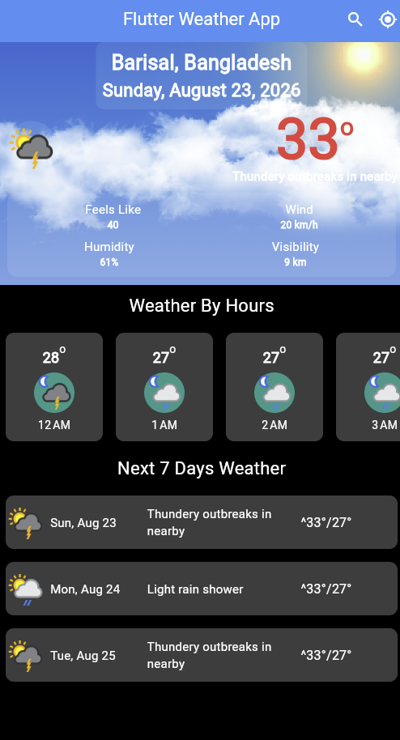
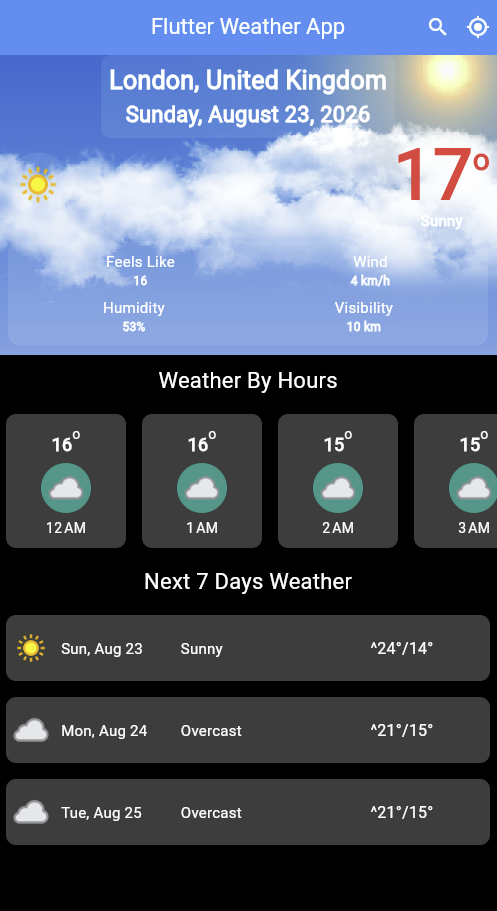

# 🌦️ Weather App

A modern, fast, and beautiful Weather Application built with **Flutter**. This app fetches real-time weather data and accurate forecasts from across the globe using the **Weather API**.

## 📸 Screenshots

<p align="center">
  
  
</p>

### ✨ Features

*   **Real-time Weather:** Get the latest weather updates and current conditions for any city.
*   **Global Search:** Easily search weather data for any location worldwide by city name.
*   **Dynamic Backgrounds:** Integrated with `flutter_weather_bg` to show beautiful animations based on current weather (Sunny, Rainy, Cloudy, etc.).
*   **Detailed Metrics:** View essential weather details like Feels Like temperature, Wind speed, Humidity, and Visibility.
*   **Hourly & Daily Forecast:** Access precise hourly updates and a 7-day future forecast to plan your week.
*   **Auto Location:** Fetch weather data automatically based on your current IP location.

### 🚀 Technologies Used

*   **Flutter & Dart**
*   **Weather API** (weatherapi.com)
*   **Http Package** (for API calling)
*   **Intl Package** (for date and time formatting)
*   **Flutter Weather BG** (for dynamic weather animations)

### 🛠️ Installation

1. **Clone the repository:**
   ```bash
   git clone https://github.com/arifhossain07/flutter-weather-app.git
   ```

2. **Install dependencies:**
   ```bash
   flutter pub get
   ```

3. **Run the app:**
   ```bash
   flutter run
   ```
